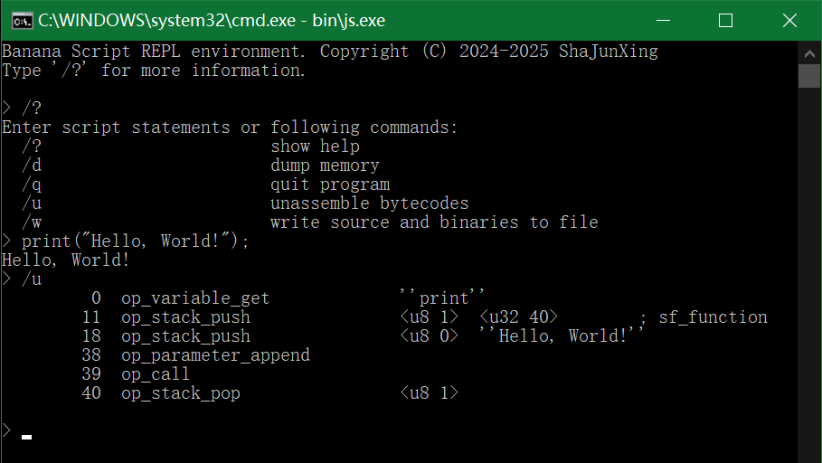
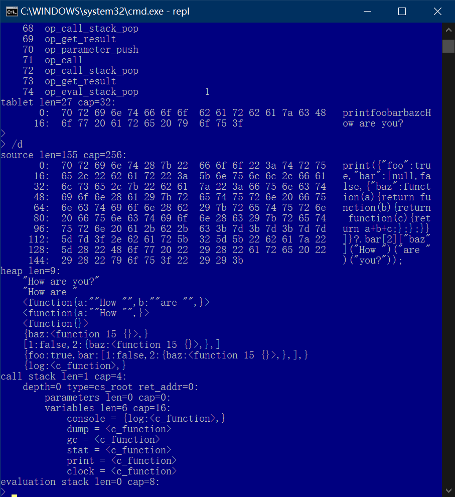

# Banana Script, An inperpreter for a strict subset of JavaScript

This article is openly licensed via [CC BY-NC-ND 4.0](https://creativecommons.org/licenses/by-nc-nd/4.0/).

[English Version](README.md) | [Chinese Version](README_zhCN.md)

Project Address: <https://github.com/shajunxing/banana-script>





## Introduction

My goal is to remove and modify useless and ambiguous parts of JavaScript language that I've summarized in practice, and to create a minimal syntax interpreter by keeping only what I like and need. **Only JSON-compatible data types and function are supported, function is first-class value, and function supports closure. I don't like object-oriented programming, so everything class related are not supported**. There are no built-in immunable global variables, global functions, or object members, even contents added during interpreter initialization can be easily deleted at any time and reverted to clean empty state.

## Two-Minute Brief Syntax Guide for Proficient JavaScript Users

Data types are `null` `boolean` `number` `string` `array` `object` `function`, results of `typeof` correspond strictly to these names. No `undefined` because `null` is enough. Array and object are clean, no predefined members such as `__proto__`.

Variable declaraction use `let`, all variables are local, `const` is not supported because all must be deletable. Access undeclared variables will cause error, access array/object's unexisting members will get `null`, and put `null` will delete corresponding member.

Function definition supports default argument `param = value` and rest argument `...args`. Array literal and function call support spread syntax `...`, which will not skip `null` members. No predefined members such as `this` `arguments` in function. If `return` is outside function, means exit vm.

Operators follow strict rule, no implicit conversion. Only boolean can do logical operations. `== !=` are strict meaning, and can be done by all types. Strings can do all relational operations and `+`. Numbers can do all relational and numerical operations. Operator precedence from low to high is:

- Ternary operator `?` `:`
- Logical or operator `||`
- Logical and operator `&&`
- Relational operator `==` `!=` `<` `<=` `>` `>=`
- Additive operator `+` `-`
- Multiplicative operator `*` `/` `%`
- Exponential operator `**`
- Prefix operator `+` `-` `!` `typeof`
- Array/object member access and function call operator `[]` `.` `?.` `()`

Assignment expression `=` `+=` `-=` `*=` `/=` `%=` `++` `--` does not return value, Comma expression `,` is not supported.

Add double colon binding operator, which `value::function(...args)` is equivalent to `function(value, ...args)`. This will definitely make class lovers happy because they can easily write oo style code, and even nice chain syntax style.

Conditional statement is `if`, loops are `while` `do while` `for`, conditions must be boolean. `for` loop only support following syntax, `[]` means optional. `for in` and `for of` only handle non-null members:

- `for ([[let] variable = expression ] ; [condition] ; [assignment expression])`
- `for ([let] variable in array/object)`
- `for ([let] variable of array/object)`

No modules. In inperpreter's view, source code is only one large flat text.

Garbage collection is manual, you can do it at any time you need.

`delete` means delete local variable within current scope (object members can be deleted by setting `null`). For example, variables added to the function closure are all local variables before function variable declaration, so unused variables can be `delete`d before return to reduce closure size, run following two statements in REPL environment to see differences.

- `let f = function(a, b){let c = a + b; return function(d){return c + d;};}(1, 2); dump(); print(f(3)); delete f;`
- `let f = function(a, b){let c = a + b; delete a; delete b; return function(d){return c + d;};}(1, 2); dump(); print(f(3)); delete f;`

`throw` can throw any value, which are received by `catch`. `finally` is not supported, because I think it's totally unecessary, and will make code execution order weird.

## Technical internals

This project is C99 compatable, no other dependences, even make systems are not necessary, only need C compiler, compilation environment is msgc/gcc/mingw. First, from <https://github.com/shajunxing/banana-nomake> download single file `make.h`, then open `make.c`, modify `#include` to correct path, then with msvc type `cl make.c && make.exe release`, or with mingw type `gcc -o make.exe make.c && ./make.exe release`, or with gcc type `gcc -o make make.c && ./make release`. Executables are in `bin` folder.

Project follows "minimal dependency" rule, only including necessary headers. Also, there's only one-way referencing between modules, with no circular referencing. Here’s how modules work and their dependencies:

```
js-common   js-data     js-vm       js-syntax
    <-----------
                <-----------
                            <-----------
    <-----------------------
    <-----------------------------------
```

- `js-common`: Constants, macro definitions, and functions common to project, such as log, memory io
- `js-data`: Data types and garbage collection, you can even use this module separately in C projects to manipulate high-level data structures with GC functionality, see <https://github.com/shajunxing/banana-cvar>
- `js-vm`: Bytecode Virtual Machine, compiled separately to get an interpreter with minimal footprint without source code parsing
- `js-syntax`: Lexical parsing and syntax parsing, which converts source code into bytecode
- `js-std`: A reference implementation of some commonly used standard functions. Note that it's just for reference when writing C functions and doesn't guarantee it will change in future. For specific usage, check out my other project <https://github.com/shajunxing/view-comic-here>

All values are `struct js_value` type, you can create by `js_xxx()` functions, `xxx` is value type, and you can read c values direct from this struct, see definition in `js_data.h`. Created values follow garbage collecting rules. DON'T directly modify their content, if you want to get different values, create new one. Compound types `array` `object` can be operated by `js_array_xxx()` `js_object_xxx()` functions.

C functions must be `struct js_result (*)(struct js_vm *)` format, use `js_c_function()` to create c function value, yes of course they are all values and can be put anywhere, for example, if put on stack root using `js_declare_variable()`, they will be global. `struct js_result` has two members, if `.success` is true, `.value` is return value, if false, `.value` is received by `catch` if there are `try catch`. c function can also call script function using `js_call()`. Inside C function, use `js_get_arguments_base()` `js_get_arguments_length()` `js_get_argument()` to get passed in arguments.

There are 2 types of string: `vt_scripture` means immutable c string literal in engine c source code, eg. `typeof` result, and `vt_string` are mutable. They are all null terminated. They can be used for futher optimization.

Value types `vt_string`, `vt_array`, `vt_object` and `vt_function` are hang on engine context's `heap`, and managed by garbage collector. Why `vt_function` is managed is because it has closure.

Variable scope is combined into call stack. Call stack has following types: `cs_root` is root stack, which is unique and not deletable, `cs_block` means block statement scope, `cs_loop` is loop scope to fit `break` and specially to fit `let` in `for` loop, `cs_function` is function scope and in which `args` and `jmp_addr` are available.

Hashmap operation `js_map_put`'s algorithm:

    loop key      loop value      new value      operation
    -----------------------------------------------------------
    null          not null        ..             fatal, shouldn't happen
    null          not null        ..             fatal, shouldn't happen
    null          null            not null       add key value, length++, chech rehash
    null          null            null           no op, return
    matched       not null        not null       replace value, return
    matched       not null        null           replace value, length--, return
    matched       null            not null       replace value, length++, chech rehash
    matched       null            null           return
    not matched   not null        ..             continue
    not matched   not null        ..             continue
    not matched   null            not null       next stage
    not matched   null            null           next stage
    whole loop ended              ..             fatal, shouldn't happen
    whole loop ended              ..             fatal, shouldn't happen

may encounter "not matched null" -> "not matched null" -> ... -> "matched", if operate with first result, will cause duplicate, so "not matched null" may enter next stage, record position, and special treat:

    null          null            not null       replace key value to recorded position, length++, chech rehash
    not matched                                  continue
    whole loop ended                             replace key value to recorded position, length++, chech rehash

all stages must chech rehash, especially stage 2, or sometimes will fatal "Whole loop ended, this shouldn't happen" (because is full, no empty space)

test_js_value_loop generated 6.5G huge dump.txt, use tail command:

```
length=0 capacity=0
key=b, value=vt_number
length=1 capacity=2
    0 b vt_number
    1  vt_undefined
key=b, value=vt_undefined
length=0 capacity=2
    0 b vt_undefined
    1  vt_undefined
key=5zNugcVa2jZNC1oSNbqg6yd9bIYTaYisB4rv6Hpfknt0d0SVgYtYbdlVjhJ2puzSagZZs9o, value=vt_undefined
length=0 capacity=2
    0 b vt_undefined
    1  vt_undefined
key=Swy4fCH8h03lkwQwW9BxW7O3dH9EReeng80wiI37Jwid6RXMwQ0cgiPn, value=vt_scripture
length=1 capacity=2
    0 b vt_undefined
    1 Swy4fCH8h03lkwQwW9BxW7O3dH9EReeng80wiI37Jwid6RXMwQ0cgiPn vt_scripture
key=CVUcQn5KYZkjKSa1eJAsg0nUQsnZBdSNquxXsYnwIoNTEAtZBOt, value=vt_array
length=2 capacity=2
    0 CVUcQn5KYZkjKSa1eJAsg0nUQsnZBdSNquxXsYnwIoNTEAtZBOt vt_array
    1 Swy4fCH8h03lkwQwW9BxW7O3dH9EReeng80wiI37Jwid6RXMwQ0cgiPn vt_scripture
key=EFvi653FKJKm04nqvfux6YzKZhmukC7biyUhulH9eLPxZUX, value=vt_c_function
ERROR src\js-data.c:144:js_map_put: Fatal error: Whole loop ended, this shouldn't happen
```

when handling rehash, DON'T return a new map like realloc(), that's very stupid, if this map is another data structute's element, it will become wild pointer

val can be NULL. If key does not exist, will skip. If key exists, means delete operation, set val to NULL, k unchanged, so that rehash no needed, to make sure find loop won't break if following keys exists

"length" means number of keys in map, it is meanless for user because NULL val exists, DON'T use it outside

when rehash, not null key null value will not be added

EBNF

https://www.cnblogs.com/dhy2000/p/15970225.html
https://zh.wikipedia.org/wiki/%E9%80%92%E5%BD%92%E4%B8%8B%E9%99%8D%E8%A7%A3%E6%9E%90%E5%99%A8
https://gist.github.com/Chubek/0ab33e40b01a029a7195326e89646ec5

https://www.json.org/json-en.html
https://lark-parser.readthedocs.io/en/latest/json_tutorial.html

object key can be identifier, which means string, NOT identifier corresponding value

function rest argument support:
https://developer.mozilla.org/en-US/docs/Web/JavaScript/Reference/Functions/rest_parameters
spread syntax support:
https://developer.mozilla.org/en-US/docs/Web/JavaScript/Reference/Operators/Spread_syntax

    value = null | boolean | number | string | array | object | function | c_function
    array = '[' [expression|'...'access_call_expression (',' expression|'...'access_call_expression)] ']'
    object = '{' [string|identifier ':' expression (',' string|identifier ':' expression)] '}'
    function = 'function' _function
    _function = '(' [identifier[=expression] [,identifier[=expression]]][...identifier] ')' '{' { statement } '}'

Operator precedence
https://developer.mozilla.org/en-US/docs/Web/JavaScript/Reference/Operators/Operator_precedence

    18: grouping: ()
    17: access and call: [] . ?. function()
    15: postfix operators ++ --
    14: prefix operators: !
    13: **
    12: * / %
    11: + -
    9: < <= > >=
    8: == !=
    4: &&
    3: ||
    2. = += ?: 
    1. ,

I modify it:

    (*high*)
    accessor = (identifier|'('expression')'|value){'['additive_expression']'|('.'|'?.')identifier|'('[expression|'...'access_call_expression[,expression|'...'access_call_expression]]')'}
    access_call_expression = accessor (* as rvalue *)
    prefix_expression = ['!'|'+'|'-'] access_call_expression
    exponentiatial_expression = prefix_expression {'**' prefix_expression}
    multiplicative_expression = exponentiation_expression {('*'|'/'|'%') exponentiation_expression}
    additive_expression = multiplicative_expression {('+'|'-') multiplicative_expression}
    relational_expression = additive_expression [('=='|'!='|'<'|'<='|'>'|'>=') additive_expression]
    logical_and_expression = relational_expression {'&&' relational_expression}
    logical_or_expression = logical_and_expression {'||' logical_and_expression}
    expression = logical_or_expression ['?' logical_or_expression ':' logical_or_expression]
    (*low*)

xxx_expression is only name from LOWEST precedence to HIGHEST, for example, relational_expression can also be numerical value, lowest name expression is shortened to be expression

only inside () [] can start from expression, elsewhere expression to prevent = , conflict

DON'T add comma_expression and DON'T put assignment_expression into the chain, because left value has to be lazyed, it is too complicated to deliver lazy evaluation literal representation such as 'foo["bar"]' in each chain, and more and more complicated, for example, have to save object key as dynamic, because it may be a result.

string can do following operations:

    + means strcat()
    < <= > >= == != means strcmp(), -1 is <, 0 is ==, 1 is >

https://developer.mozilla.org/en-US/docs/Web/JavaScript/Reference/Operators/Strict_equality

    == means strict equals
    If the operands are of different types, return false.
    If both operands are objects, return true only if they refer to the same object.
    If both operands are null or both operands are undefined, return true.
    If either operand is NaN, return false.
    Otherwise, compare the two operand's values:
    Numbers must have the same numeric values. +0 and -0 are considered to be the same value.
    Strings must have the same characters in the same order.
    Booleans must be both true or both false.

Standalone, not belong to expressions chain, used in 'for' loop
use 'expression' to prevent conflict, still can down to () to include them:

    assignment_expression = accessor(* as lvalue *) [ '='|'+='|'-='|'*='|'/='|'%='|'++'|'--' expression ]
    declaration_expression = 'let' identifier['='expression] { ',' identifier['='expression] }

    script = { statement }
    statement = ';'
            | '{' { statement } '}'
            | 'if' '(' expression ')' statement ['else' statement]
            | 'while' '(' expression ')' statement
            | 'do' statement 'while' '(' expression ')' ';'
            | 'for' '(' ( (('let' identifier)|accessor) (('='expression';'[expression]';'[assignment_expression])|('in'|'of'access_call_expression)) ) | (';'[expression]';'[assignment_expression])  ')' statement
            | 'break' ';'
            | 'continue' ';'
            | 'function' identifier _function
            | 'return' [expression] ';'
            | 'delete' identifier ';'
            | 'try' '{' { statement } '}' ['catch' '(' identifier ')' '{' { statement } '}' ]
            | 'throw' expression ';'
            | declaration_expression ';'
            | assignment_expression ';'

assignment_expression put at last, because it cannot be determined by first token

function is variable, function scope is same as variable, can only visit same or parent levels

    let a;
    function foo () {
        let b;
        function qux() {}
        function bar() {
            let c;
            function baz() {
            }
        }
    }

for loop types in parser:

    for (let a = b;
    for (let a in
    for (let a of
    for (;
    for (a = b;
    for (a in
    for (a of

DON'T use inline, even slower in mingw and size increased about 10k

Why upgrade to C99?

- Array initialization with enum indices in C <https://eli.thegreenplace.net/2011/02/15/array-initialization-with-enum-indices-in-c-but-not-c>
- vsnprintf
- anonymous struct/union
- compound literal such as (struct foo){...}
- binary literal '0b'
- __func__
- typeof (c23)

New vm instruction structure:

```
support maximum 64 opcodes, 0-3 operands, 16 operand types
instruction binary structure is (C means opcode, D E F means 1st 2nd 3rd operand type):
             low -> high
no operand : CCCCCC00
 1 operand : CCCCCC01 DDDD0000 ...operand0...
 2 operands: CCCCCC10 DDDDEEEE ...operand0... ...operand1...
 3 operands: CCCCCC11 DDDDEEEE FFFF0000 ...operand0... ...operand1... ...operand2...
```

Length limits for some fields (if not specified, will be 'size_t'):

|||
|-|-|
|uint8_t|some types|
|uint16_t|number of globals, locals, arguments, closure. object key, stack length|
|uint32_t|scripture, source, bytecode length|

Variable scope:

    local->closure->global

function parameters are not standalone scope, they will be merged into locals, so 'function(a){let a;}' is not allowed. for example, "function foo(a) { let b; return function bar() {}; }", a and b will all be put into bar's closure, they must prevent naming confliction.

Before op_call, stack layout is shown below, just fit accessor model:

    (* top *)
    sf_function(egress, arguments, ...)
    sf_value(function/c_function)
    (* bottom *)

Before function returns, push return value to stack

Map based variable speed too low problem, if using ast, maybe can change to index visit. But functions may be dynamic, so maybe only local variables can determine position?

```
Macro and function naming rule:
prefix _ means local file scope
prefix __ means function scope
Function variables do not necessarily follow this rule
Macro argument must prefix with __arg_, to prevent if some struct members have same name and appear inside macro, will wrongly be replaced
```

    /*
    test special cases
    node.js, quickjs will treat both a and b as reference
    node.js:
        [ 1, [ 1 ] ]
        [ 2, [ 2 ] ]
    quickjs:
        1,1
        2,2
    in banana script, for better performence, only strings, arrays, objects, functions are passed by reference, so a is seperated, if you want to be connected, use array or object. But after all, it is not a good practise, better not using OO style.
    */
    function foo() {
        let a;
        let b = [];
        function bar(i, j) {
            a = i;
            b[0] = j;
        }
        function qux() {
            return [a, b];
        }
        return [bar, qux];
    }
    let barqux = foo();
    barqux[0](1, 1);
    console.log(barqux[1]());
    barqux[0](2, 2);
    console.log(barqux[1]());

In gcc, DON'T use const in struct, will cause entire struct be const, see: https://stackoverflow.com/questions/34989921/assignment-of-read-only-member-error-when-assigning-to-non-const-member-of-a-s

Add '::' after using AST, have to use AST, top-down mechanism cannot pass lvalue as rvalue (function) 's first operand. AST can do transformation.

    let z = 10;
    function foo(a = z, b, ...c) { // parameter default value can be an expression, so it is not fixed
        console.log(c);
    }
    bar(1, 2, ...arr); // number of arguments cannot be determined at compile time
    function foo() {
        let a = 1;
        let bar = function (b) {
            return a + b;
        }; // test whether 'bar' will be wrongly added into closure to cause recursion
        return bar;
    }
    // test undefined array hole correctly converted to null
    function foo(a, b, c) {
        dump();
    }
    foo(...[null, null, 3]);

    TODO: better remove 'delete' operator, because it's variable modification action is at runtime, "if (...) { delete ...; }", but variable creating is at compile time? or runtime? "if (...) { let ...; }", if using AST to change variables visitation from hashmap to array?

    C functions have no closure, because they are always static, not dynamically created, so they don't have creation scope, unlike lua, lua's purpose is only for saving data across function call.