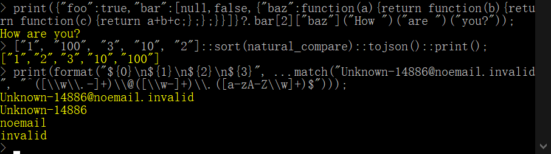

# Banana Script，一个严格子集 JavaScript 的解释器

本文使用 [CC BY-NC-ND 4.0](https://creativecommons.org/licenses/by-nc-nd/4.0/) 许可。

[英文版](README.md) | [中文版](README_zhCN.md)

项目地址：<https://github.com/shajunxing/banana-script>



## 特色

我的目标是剔除和修改我在实践中总结的JavaScript语言的没用的和模棱两可的部分，只保留我喜欢和需要的，创建一个最小语法的解释器。**只支持 JSON 兼容的数据类型和函数，函数是第一类值，函数支持闭包。我不喜欢面向对象编程，所以所有与类相关的内容都不支持**。没有任何内置不可删除的全局变量、全局函数或对象成员，哪怕解释器初始化的时候加入的内容都可以在任何时候轻松删除，恢复到空空如也的状态。

## 给JavaScript熟练者的两分钟简要语法指南

数值类型为`null` `boolean` `number` `string` `array` `object` `function`，`typeof`的结果严格对应这些名字。不支持 `undefined`，因为 `null` 已经足够。数组和对象是干净的，没有预定义的成员，比如`__proto__`。

变量声明使用 `let`，所有变量都是局部变量，不支持 `const`，因为一切都必须可删除。访问未声明的变量会引发错误，访问数组/对象不存在的成员会返回 `null`，写入`null`则为删除对应成员。

函数定义只支持`function`关键字，不支持`=>`表达式。支持默认参数 `param = value` 和剩余参数 `...args`。数组字面量和函数调用支持展开语法 `...`，不会跳过`null`成员。函数中没有 预定义的成员比如`this` `arguments`。`return` 如果在函数外部，意为退出虚拟机。

运算符遵循严格规则，没有隐式转换。只有布尔值可以进行逻辑运算。`== !=` 是严格意义上的比较，可以应用于所有类型。字符串支持所有关系运算符和 `+`。数字支持所有关系和数值运算符。运算符的优先级从低到高为：

- 三元运算符 `?` `:`
- 逻辑或运算符 `||`
- 逻辑与运算符 `&&`
- 关系运算符 `==` `!=` `<` `<=` `>` `>=`
- 加减运算符 `+` `-`
- 乘除运算符 `*` `/` `%`
- 指数运算符 `**`
- 前缀运算符 `+` `-` `!` `typeof`
- 数组/对象成员访问和函数调用运算符 `[]` `.` `?.` `()`

赋值表达式 `=` `+=` `-=` `*=` `/=` `%=` `++` `--` 不返回值。不支持逗号表达式 `,`。

增加双冒号绑定运算符，语义为 `value::function(...args)` 等价于 `function(value, ...args)`，如此Class爱好者会很开心，因为能轻松写出面向对象范儿，甚至漂亮的链式语法风格。

条件语句是`if`，循环语句是`while` `do while` `for`，条件必须是布尔值。`for` 循环仅支持以下语法，`[]` 表示可选部分。`for in` 和 `for of` 只处理非 `null` 的成员：

- `for ([[let] variable = expression ] ; [condition] ; [assignment expression])`
- `for ([let] variable in array/object)`
- `for ([let] variable of array/object)`

不支持模块。在解释器的视角中，源码只是一个大的平坦文本。

垃圾回收是手动的，你可以在你需要的任何时候执行。

`delete` 语义为删除当前作用域范围的局部变量（对象成员置`null`即可删除）。比如，加入函数闭包的变量是声明函数变量之前的所有局部变量，可以在返回之前`delete`掉无用的变量以减少闭包大小，在REPL环境里执行以下两条语句，可以看到区别。

- `let f = function(a, b){let c = a + b; return function(d){return c + d;};}(1, 2); dump_vm(); print(f(3)); delete f;`
- `let f = function(a, b){let c = a + b; delete a; delete b; return function(d){return c + d;};}(1, 2); dump_vm(); print(f(3)); delete f;`

`throw` 可以抛出任意值，由`catch`接收。不支持`finally`，因为我认为根本不需要，反而会使代码执行顺序显得怪异。

## 标准库

包含最常使用的输入输出和数值处理函数，以下是已经基本固定不变的函数，更多的参考 [examples/7-std.js](https://github.com/shajunxing/banana-script/blob/main/examples/7-std.js) 和 [src/js-std.c](https://github.com/shajunxing/banana-script/blob/main/src/js-std.c)。

函数命名规则：

1. 最常用的，取最常用的名字，比如控制台输入输出，就是`input` `print`，最方便记忆，我请chatgpt帮我统计过使用率。
2. 单一功能的，匹配一个 dos/unix 命令或 c std/unistd 函数，例如 `cd` `md` `rd`，用最短的那个，这样还能提高速度。
3. 非单一功能的，定制名称。

函数描述规则：

类似c语言函数格式，参数和返回值类型可以是 `null` `boolean` ... ，也可以用 `/` 表示多种类型、`any` 表示任意类型。`[]` 表示可选参数，`...`表示不限量参数。

`string input([string prompt])` 打印提示符（可选）并接受用户输入一行。如果需要数值，可用`number tonumber(string str)` 将字符串转换为数值。

`null print([any value], ...)` 打印零个或多个值，用空格分隔，结尾换行。值的呈现形式有三类，从复杂到简单分别是 `dump` `json` `user`，`print()`函数用的是第三类，另有`dump()`与其格式一样，但用的是第一类。还有两个函数 `string tojson(any value)` `string tostring(any value)` 用于把任意值转换成第二和第三类呈现形式的字符串。

```
string read(number handle)
string read(string filename/cmdline)
string read(string filename/cmdline, boolean iscommand)
null read(number handle, function callback)
null read(string filename/cmdline, function callback)
null read(string filename/cmdline, boolean iscommand, function callback)
```

用于文本文件或控制台进程输出的通用读取函数，该函数接受以数字表示的文件/进程句柄，或以字符串表示的文件名/命令行，其中，`iscommand` 表示是否为进程命令行，默认为文件名。如果不存在 `callback` 函数，该函数将读取整个文件内容/进程输出并返回；如果存在，则在每一行上调用 `callback` 函数，并将该行作为参数传递。

```
null write(number handle, string text)
null write(string filename, string text)
null write(string filename, boolean isappend, string text)
```

用于文本文件的通用写入功能，接受数字表示的文件句柄或字符串表示的文件名。`isappend` 参数表示在文件末尾追加内容，而不是覆盖文件。

`array/null match(string text, string pattern)` 正则表达式匹配。如果匹配，返回所有捕获，否则返回`null`，正则表达式当前支持 `^` `$` `()` `\d` `\s` `\w` `[]` `*` `+` `?`。

`number argc` `array argv` 进程命令行参数。

`string os` 操作系统类型，可以是`windows`或`posix`。

`string pathsep` 路径分隔符，可以是`\`或`/`。

`null cd(string path)` `null md(string path)` `null rd(string path)` `null rd(string path)` 进入目录、创建目录、删除目录、删除文件。

`string cwd()` 返回进程当前工作目录。

## 技术内幕

本项目兼容 C99，没有其他依赖，甚至不需要 make 系统，只需要 C 编译器，编译环境为 msvc/gcc/mingw。首先，从 <https://github.com/shajunxing/banana-nomake> 下载单独文件 `make.h`，然后打开 `make.c`，修改 `#include` 为正确的路径，然后 msvc 输入 `cl make.c && make.exe release`，或者 mingw 输入 `gcc -o make.exe make.c && ./make.exe release`，或者 gcc 输入 `gcc -o make make.c && ./make release`。可执行文件位于 `bin` 文件夹中。

项目遵循“最小依赖”原则，只包含必须的头文件，且模块之间只有单向引用，没有循环引用。模块的功能和依赖关系如下：

```
    js-common   js-data     js-vm       js-syntax   js-std
        <-----------
        <-----------------------
                    <-----------
        <-----------------------------------
                                <-----------
        <-----------------------------------------------
                                <-----------------------
```

- `js-common`： 项目通用的常量、宏定义和函数，例如日志打印、内存读写
- `js-data`：数值类型和垃圾回收，你甚至可以在C项目里单独使用该模块操作带GC功能的高级数据结构，参见 <https://github.com/shajunxing/banana-cvar>
- `js-vm`：字节码虚拟机，单独编译可得到不带源代码解析功能的最小足迹的解释器
- `js-syntax`：词法解析和语法解析，将源代码转化为字节码
- `js-std`：一些常用标准函数的参考实现，注意只是用作编写C函数的参考，不保证将来会变，具体用法可参考 [examples/7-std.js](https://github.com/shajunxing/banana-script/blob/main/examples/7-std.js) 以及我的另一个项目 <https://github.com/shajunxing/view-comic-here>

所有值都是 `struct js_value` 类型，你可以通过 `js_xxx()` 函数创建，`xxx` 是值类型，你可以直接从这个结构体中读取 C 值，参见 `js_data.h` 中的定义。创建的值遵循垃圾回收规则。不要直接修改它们，如果你想得到不同的值，就创建新值。复合类型 `array` `object` 可以通过 `js_array_xxx()` `js_object_xxx()` 函数进行操作。

C 函数必须是 `struct js_result (*)(struct js_vm *)` 格式，使用 `js_c_function()` 来创建 C 函数值，是的，当然它们都是值，可以放在任何地方，例如，如果使用 `js_declare_variable()` 放在堆栈根上，它们就是全局的。`struct js_result` 有两个成员，如果 `.success` 是 true, `.value` 就是返回值, 如果 false, `.value` 将会被 `catch` 接收，如果 `try catch` 存在的话。C函数同样也可以使用 `js_call()`调用脚本函数。在C函数内部，使用`js_get_arguments_base()` `js_get_arguments_length()` `js_get_argument()`函数获取传入参数。

与C语言的交互可参考 [src/js-std.c](https://github.com/shajunxing/banana-script/blob/main/src/js-std.c)。

## 其它详见英文版

