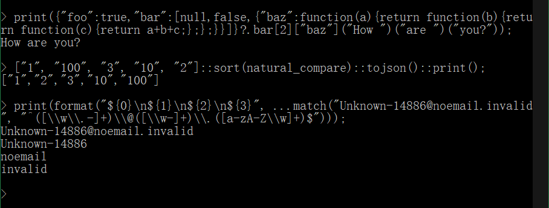

# Banana JS，一个严格子集 JavaScript 的解释器

本文使用 [CC BY-NC-ND 4.0](https://creativecommons.org/licenses/by-nc-nd/4.0/) 许可。

[英文版](README.md) | [中文版](README_zhCN.md)

## 2025.02.10

经过大量代码重构，从引入令牌缓存到使用`js_value`代替`js_value *`以减少大量内存分配操作（结构赋值比内存分配快约10倍），再到引入字节码，性能与Python的比较从十几降至约5，现在性能问题主要集中在哈希映射操作上，例如`js_variable_get`。也许在未来，变量访问可以优化为数组操作。

## 介绍

我的目标是剔除我在实践中总结的JavaScript语言的没用的和模棱两可的部分，只保留我喜欢和需要的，创建一个最小的语法解释器。**只支持 JSON 兼容的数据类型和函数，函数是第一类值，函数支持闭包。我不喜欢面向对象编程，所以所有与类相关的内容都不支持**。没有任何内置不可删除的全局变量、全局函数或对象成员，哪怕解释器初始化的时候加入的内容都可以在任何时候轻松删除，恢复到空空如也的状态。

## 构建

本项目兼容 C89，没有其他依赖，甚至不需要 make 系统，只需要 C 编译器，目前在 msvc 和 mingw 上测试过。首先，下载我的另一个项目 [Banana Make](https://github.com/shajunxing/banana-make)，这是一个单独的文件 `make.h`，然后打开 `make.c`，修改 `#include` 为正确的路径，然后使用 msvc 输入 `cl make.c && make.exe release`，或者使用 mingw 输入 `gcc -o make.exe make.c && ./make.exe release`。除了`release`编译模式之外，还有`debug`和`ndebug`另外两个模式，分别表示保留调试符号并显示日志输出，以及保留调试符号但是隐藏日志输出。可执行文件位于 `bin` 文件夹中，包括 REPL 环境、脚本执行器、一个有趣的玩具计算器和词法语法解析器测试工具。

## 语法

数值类型为`null、boolean、number、string、array、object、function`，`typeof`的结果严格对应这些名字。不支持 `undefined`，因为 `null` 已经足够。数组和对象是干净的，没有预定义的成员，比如原型。

变量声明使用 `let`，所有变量都是局部变量。访问未声明的变量会引发错误，访问数组/对象不存在的成员会返回 `null`。不支持 `const`，因为它没有意义。例如，一个常量指向一个数组/对象，那么它的成员是否应该不可变？如果不是，那我为什么要使用 `const`？如果是，那值必须被标记为不可变，但这在垃圾回收器的视角下显得很奇怪，因为所有的值都应该是可清理的。

函数定义支持默认参数 `param = value` 和剩余参数 `...params`。数组字面量和函数调用支持扩展语法 `...`，不会跳过`null`成员。函数中没有 `this, arguments`。

运算符遵循严格规则，没有隐式转换。只有布尔值可以进行逻辑运算。`== !=` 是严格意义上的比较，可以应用于所有类型。字符串支持所有关系运算符和 `+`。数字支持所有关系和数值运算符。运算符的优先级从低到高为：

- 三元运算符 `? :`
- `&& ||`
- `== != < <= > >=`
- `+ -`
- `* / %`
- 前缀运算符 `+ - ! typeof`
- 数组/对象成员访问和函数调用运算符 `[] . ?. ()`

赋值表达式 `= += -= *= /= %= ++ --` 不返回值。不支持逗号表达式 `,`。

`if`、`while`、`do while`、`for` 的条件必须是布尔值。`for` 循环仅支持以下语法，`[]` 表示可选部分。`for in` 和 `for of` 只处理非 `null` 的成员：

- `for ([[let] variable = expression ] ; [condition] ; [assignment expression])`
- `for ([let] variable in array/object)`
- `for ([let] variable of array/object)`

不支持模块。在解释器的视角中，源码只是一个大的平坦文本。

垃圾回收是手动的，你可以在你需要的任何时候执行。

`delete` 语义和JavaScript不同，JavaScript删除的是对象成员，但这毫无意义，因为只需要把它们置为`null`即可。在这里`delete`可以删除当前堆栈层级的局部变量。比如，可以配合垃圾收集器把执行环境清空得一点不剩。再比如，加入函数闭包的变量是返回之前的所有局部变量，可以在返回之前`delete`掉用不到变量以减少闭包大小，在REPL环境里执行以下两条语句，可以看到区别。

- `let f = function(a, b){let c = a + b; return function(d){return c + d;};}(1, 2); dump(); print(f(3)); delete f;`
- `let f = function(a, b){let c = a + b; delete a; delete b; return function(d){return c + d;};}(1, 2); dump(); print(f(3)); delete f;`

## 标准库以及与C语言的互操作性

所有值都是 `struct js_value` 类型，你可以通过 `js_xxx()` 函数创建，`xxx` 是值类型，你可以直接从这个结构体中读取 C 值，参见 `js.h` 中的定义。所有创建的值都由此引擎的核心上下文 `struct js *` 管理，遵循垃圾回收规则。不要直接修改它们，如果你想得到不同的值，就创建新值。复合类型 `array object` 可以通过 `js_array_xxx() js_object_xxx()` 函数进行操作。

C 函数必须是 `void (*)(struct js *)` 格式，使用 `js_c_function()` 来创建 C 函数值，是的，当然它们都是值，可以放在任何地方，例如，如果使用 `js_variable_declare()` 放在堆栈根上，它们就是全局的。在 C 函数中，传入的参数可以通过 `js_parameter_length() js_parameter_get()` 函数获取，返回值只需放入 `struct js *` 的 `result` 即可。

## 技术内幕

参见英文版